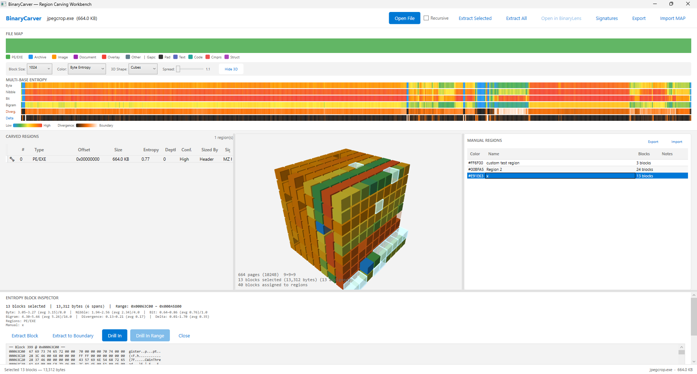

# BinaryCarver

A Windows desktop application for scanning binary files to find embedded files, analyze entropy patterns, and export region maps for reverse engineering tools. Think **binwalk with a GUI** — plus 3D visualization, multi-base entropy analysis, and one-click export to IDA Pro, Ghidra, radare2, and Binary Ninja.

Built with .NET 9, C#, WPF. Zero external dependencies.



## Features

### Carving Engine
- **Two-pass architecture**: Aho-Corasick multi-pattern scan (O(n+m+z)) followed by per-format structural validation
- **53+ file signatures**: PE, ELF, Mach-O, ZIP, GZIP, 7Z, RAR, PNG, JPEG, GIF, BMP, PDF, SQLite, and many more — with footer detection, min/max sizes, and specificity weighting
- **Format validators**: Deep structural parsing for PE (section tables, optional header), ZIP (central directory), PNG (chunk chain), JPEG (SOI/EOI), PDF (xref/trailer), ELF (program headers)
- **Confidence scoring**: Low / Medium / High based on structural validation depth
- **Boundary detection**: Four sizing strategies — Header parsing, Footer search, Divergence-fed entropy boundary, Fallback heuristic
- **Gap classification**: Uncarved regions classified as Padding, Text, Code, Compressed, or Structured via byte frequency analysis
- **Recursive carving**: Optionally scan inside carved regions for nested embedded files
- **Memory-mapped I/O**: Handles large files (>64MB) efficiently via `MemoryMappedFile`

### Multi-Base Entropy Analysis
Seven simultaneous entropy tracks computed per block:

- **Byte** (base-256, 0-8 bits): Standard Shannon entropy — detects encryption/compression
- **Nibble** (base-16, 0-4 bits): Reveals hex-structured data (BCD, hex dumps)
- **Bit** (base-2, 0-1 bit): Exposes bit-bias and fill patterns (null padding, 0xFF fill)
- **Bigram** (byte-pairs, 0-16 bits): Captures sequential byte correlations
- **Divergence** (cross-base): When entropy bases disagree, there's a structural boundary
- **Delta** (rate of change): Entropy transitions between blocks — spikes mark boundaries

### 3D Data Visualization
- Interactive Viewport3D showing file data as a grid of colored shapes
- Three shape modes: **Cubes**, **Bars** (height = value), **Spheres** (radius = value)
- Eight color modes matching the entropy tracks plus Region Type and Gap Class
- Spherical camera with mouse drag rotation and scroll zoom
- Click, Ctrl-click, Shift-click, double-click (flood-fill) selection
- Right-click context menu: Select/Filter by Color, Size, Size&Color, or Region Type
- Filter system: non-matching pages render as tiny dark ghosts for spatial context
- Drill into selected data, extract selection to file

### RE Tool Integration
Export region maps (with parsed internal section detail) to:

- **IDA Pro MAP** (.map) — native File > Load File > MAP File import
- **IDAPython** (.py) — `add_segm()`, `set_cmt()`, `set_color()` with PE/ELF/Mach-O section detail
- **Ghidra Script** (.py) — `createBookmark()`, `setEOLComment()`, `createLabel()` with section annotations
- **radare2** (.r2) — sections, flags, and comments ready for `r2 -i script.r2`
- **Binary Ninja** (.py) — `add_user_segment()`, `add_user_section()`, `set_comment_at()`
- **JSON** / **CSV** — full metadata export

**Import**: Load IDA MAP files or BinaryCarver JSON exports to merge external region definitions.

**Format Section Parser**: Automatically parses internal headers from PE (COFF section table), ELF (section headers + .shstrtab), Mach-O (LC_SEGMENT load commands), and ZIP (local file headers + central directory) — all sub-sections appear in RE tool exports with names, permissions, virtual addresses, and descriptions.

### UI
- Color-coded byte map with gap classification overlay
- Seven interactive entropy heatmap tracks with click-to-inspect
- Block inspector: offset, size, all entropy values, hex preview, extract/drill-in buttons
- Region grid with sortable columns (type, offset, size, entropy, confidence, sizing method)
- Detail panel with hex preview and drill-in
- Side-by-side layout: region grid + always-visible 3D view with draggable splitter
- Custom range extraction (hex or decimal offset + size)
- Custom signature editor with JSON persistence
- Drill-in navigation with Back button (stack-based, arbitrary depth)
- Drag-and-drop file loading

## Download

Grab the latest pre-built binary from [Releases](../../releases). Extract and run `BinaryCarver.exe` — no install needed, no dependencies.

## Building from Source

Requires .NET 9 SDK (Windows, x64).

```
cd BinaryCarver
dotnet build -c Release -r win-x64
```

Or use the included batch file:

```
build.bat
```

Output goes to `bin/Release/net9.0-windows/win-x64/`.

## Usage

1. Launch `BinaryCarver.exe`
2. Drop a binary file onto the window (or click Open File)
3. Explore the byte map, entropy tracks, and region grid
4. Click entropy tracks to inspect individual blocks
5. Right-click the 3D view to filter, select, drill in, or extract
6. Use Export to generate scripts for your RE tool of choice

## License

MIT
